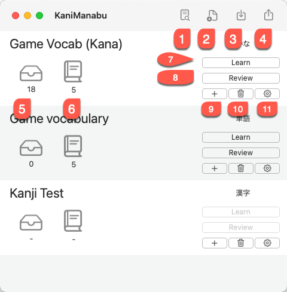
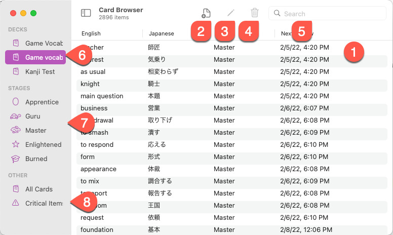
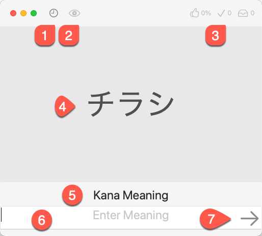
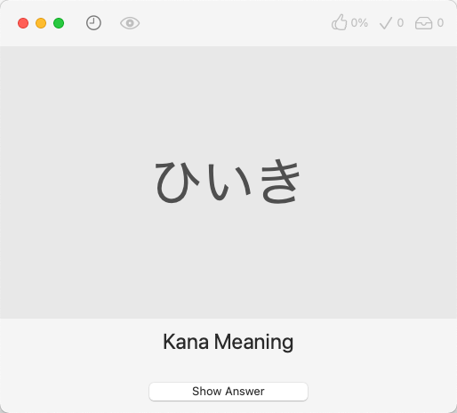
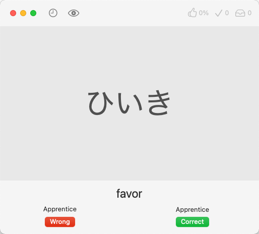

# What is KaniManabu?
KaniManabu is a WaniKani-style SRS app for macOS that allows users to memorize words by typing instead of viewing the card and picking a difficulty. KaniManabu has built in card types, which makes it easy for users to create their own decks without messing with templates.

# Things to look out before using KaniManabu
## Enable Japanese Input Method
KaniManabu requires the Japanese Input Method to be enabled to enter Hiragana or Katakana for readings when prompted.

You can enable the Japanese IME in macOS by following these steps.

1. Open System Preferences
2. Click on Keyboard
3. Clickl the Input Sources tab in Keyboard Preferences
4. Click the + button to add a new input method.
5. Type Japanese in the search field and select "Japanese - Romaji". Then click the Add button.
6. Enable Katakana and Romaji input modes.

To switch between Hiragana and Romaji mode, press CONTROL + Shift + ; for Romaji and CONTROL + Shift + J for Hiragana. For Japanese (JIS) keyboard layout, press かな for Hiragana and 英数 (えいすう, lit. letters and numbers) for Romaji. Make sure you choose the hiragana when using IME. Kanji words will not be accepted as the answer for readings. However, it will not mark the answer wrong, just warn the user.

## Install Japanese TTS Voices
With the "Automatically play audio after answer" option enabled in preferences, your Mac will say the Japanese word after you answered it correctly, except for Kanji. KaniManabu relies on the built in Text to Speech in macOS to provide this feature. You need to have the Japanese Text to Speech voices installed for this to work properly.

You can install the Japanese TTS voices by doing the following:

1. Open System Preferences.
2. Click on Accessibility
3. From the sidebar, choose **Spoken Content** for macOS 11 Big Sur or later or **Speech** in macOS 10.15 Catalina.
4. From the voice dropdown, click on it and choose the "Customize" option.
5. In the search field, type Japanese. Enable **Kyoko** and **Otoya** and click Ok
6. The voices should now download and KaniManabu should now say the Japanese words properly.

If you are using the Microsoft Voice, you do not need to follow these steps, but you need to add an API key.

## Setting up Microsoft TTS
You need an API key to use Microsoft TTS. There is a 500k character limit per month, but for most, if not all users won't reach this limit.

1. Create an account on https://portal.azure.com
2. Create a Subscription which will have your billing information
3. Create a Resource Group in East US
4. Create a Speech Service entry. Use the Free P0 plan.
5. In your Speech Service entry, your API key can be found under Resource Management -> Keys and Endpoint
6. In Preferences, copy the API key and paste it in the MS Azure TTS API key field and click save and select the Microsoft TTS voice. Microsoft TTS should now work in your learning and review sessions.

# Using the App
## Main Interface

1. **Deck Browser** - The Deck Browser allows you to browse cards from decks you have, by SRS level, and view call cards and critical items. You can manage cards in the Deck Browser.
2. **New Deck** - Creates a new deck.
3. **Import Deck** - This option allows you to import decks from a CSV file, see Importing Decks.
4. **Export Deck** - This option allows you to export a deck to a CSV file.
5. **Review Queue** - This indicates the number of cards that are in the review for a specific deck.
6. **Learning Queue** - This indicates the number of cards that are in the learning queue for a specific deck.
7. **Learn** - Starts a learning session for the deck you choose.
8. **Review** - Starts a review of cards in the review queue for the deck you choose.
9. **Add Card** - Adds a new card to the deck
10. **Delete Deck** - Deletes the deck
11. **Deck Options** - This allows you to rename the deck or set options.

## Deck Browser

1. **Cards** - Your cards in the deck/SRS Level/Critical Items will appear here.
2. **Add Card** - Adds a new card to the current deck (Does not apply to viewing cards by SRS Stage, All Cards, and Critical Items)
3. **Modify Card** - Modifies the current card
4. **Delete Card** - Deletes the current card
5. **Filter/Search Field** - This is the search field for the current deck. You can filter by English, Japanese, Kana readings, notes, and tags.
6. **Decks** - Your decks appear here
7. **SRS Stages** - View cards by SRS stage
8. **Critical Items** - These are cards that you answered correctly less than 70% of the time.

Right clicking a card also allows you to modify, delete, suspend, and reset a card.

## Learning Mode

In learning mode, you get to preview the cards before taking a quiz on them. Once you finish the quiz, the newly learned cards goes into the review queue.

1. **Go Back/Advances** - You can advance or view the previous card in the learning queue. Once you reach the end of the queue, you can start the review quiz.
2. **Play Voice** - Plays the TTS voice of the Japanese Word (doesn't apply to Kanji)
3. **Look Up in Dictionary App** - Looks up the current word in macOS's Dictionary App.
4. **Additional Resources** - Allows you to view additional resources
5. **Japanese Word/Kanji** - The word or Kanji you are learning
6. **Informations** - this contains all the information for the current card

## Review Mode (Default)

This is the review interface where you review items that are in the queue.

1. **Last 10 Items** - Views the list of 10 items you have reviewed in the current session
2. **Item Information** - Views the card's information. This button will enable after you answered.
3. **Review Status** - Shows current score, number of cards correct, and number of remaining cards in the queue.
4. **Japanese Word/Kanji** - This is the Japanese Word/Kanji you answering the question for
5. **Question Type** - This is what answer the card is prompting you.
6. **Answer Fields** - You type your answer what the card asked for here. If you enter invalid characters or an answer that is correct, but not what the card is asking, it will prompt you.
7. **Check Answer** - Check your answer by pressing the enter button or this button.

Note: Once you answered all the questions for a card, it will show the next SRS level.

## Review Mode (Anki Mode)

In Anki Mode, you guess the answer on paper or in your mind and click the **Show Answer** button.

After clicking the **Show Answer**, you select if you got the card **Correct** or **Wrong**. The next SRS level will appear above the **Correct** and **Wrong** buttons.

# Preferences
## General
* **Automatically play audio after answer** - For **Kana** and **Vocabulary** decks only, you can have the TTS (Text to Speech) play back the word after you answered the reading correctly.
* **TTS Voice**: This allows you to select what voice to use. There are three voices you can choose form. **Kyoko** and **Otoya** are voices that are built into macOS and doesn't require an internet connection to use (see Install Japanese TTS Voices to learn how to enable the voices). The **Microsoft Speech** voice uses the [Microsoft Azure Cognitive Speech Service](https://azure.microsoft.com/en-us/services/cognitive-services/text-to-speech/), which gives a more accurate pronunciation of the word. However, it requires an internet connection to use initially with a slight delay. However, the voice sample will be reused in future reviews and other words that use the same kana reading. You need to add a subscription key first before using this. Otherwise, it will fall back to the macOS TTS.
* **New Card Limit** - The global limit for learning new cards for each deck. This can be overridden in the deck settings
* **Remove Orphaned Cards** - This button removes any cards that are not associated with a deck. This is useful if the card for an associated deck wasn't deleted when the user deleted a deck.

## Privacy
* **Send Crash Data and Statistics** - This helps us find bugs and fix them before users report them. Of course, the data does not personally identify the user and won't be used for any marketing purposes or identifing the user.
